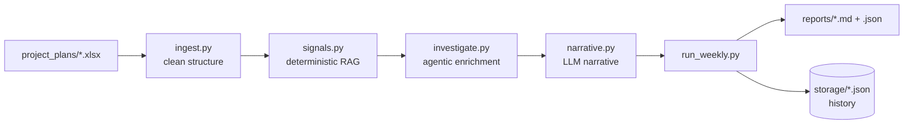
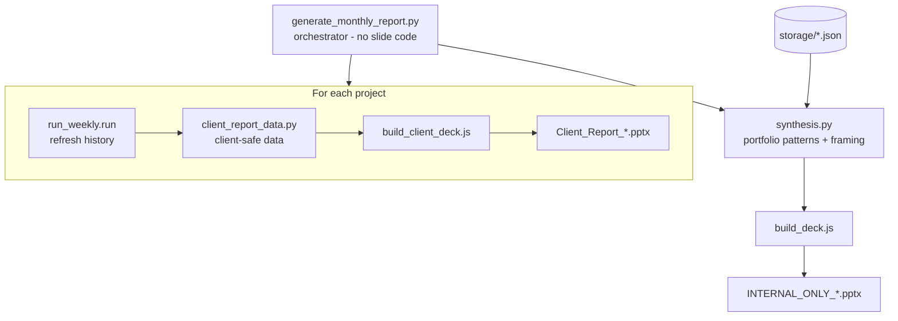
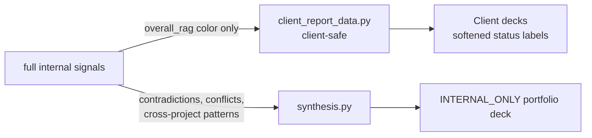

# Architecture & Design — Project Health Reporting Agent

A complete walkthrough of what this system does, how it is built, and *why*
each decision was made. For the one-page RAG framework see
[`RAG_Methodology.md`](RAG_Methodology.md); for the column-by-column data audit
see [`Data_Dictionary.md`](Data_Dictionary.md); for how to run it see
[`README.md`](README.md).

---

## 1. The problem

Leadership needs visibility into project health without manually chasing
Project Managers every week. Given raw project-plan exports (`.xlsx`), the
system must:

- read a project plan and decide a Red / Amber / Green (RAG) status,
- explain that status in plain English (not just the color),
- handle incomplete and messy data gracefully,
- run on a schedule, and
- roll up into a monthly executive presentation of cross-project trends.

These map to the assignment phases: **Phase 1** (framework), **Phase 2** (agent),
**Phase 3** (monthly synthesis), plus a scoped **Phase 4** agentic upgrade.

---

## 2. The one idea that shapes everything

> **The status is decided by deterministic, auditable rules. The LLM only
> explains or investigates — it can never change the color.**

A VP has to trust and audit a health number. If an LLM silently decided whether
a project is "Red," the number would be neither reproducible nor defensible. So
the pipeline is split into two clearly separated halves:

| Deterministic (auditable) | Generative (LLM) |
|---|---|
| `signals.py` — computes the RAG color from fixed thresholds | `narrative.py` — writes the weekly "why" paragraph |
| `synthesis.py` — computes cross-project patterns from real numbers | `synthesis.py` (framing only) — phrases those patterns |
| `investigate.py` — the RAG color is already fixed before it runs | `investigate.py` — enriches the *explanation* of a finding |

Every LLM step has a **deterministic fallback**, so the system produces valid
output even with no API key and never blocks on an external dependency.

---

## 3. High-level architecture

The weekly pipeline is one project at a time. The monthly pipeline fans this out
across all projects and then synthesizes:

---

## 4. Key design decisions (the differentiators)

### 4.1 Verify the data, don't trust it
Before writing any logic, every column in both sample files was profiled and
hypothesis-tested against the actual data (see `Data_Dictionary.md`). This
surfaced things column *names* would never reveal:

- **Dead columns** returning `#UNPARSEABLE` on every row → dropped at ingestion.
- **Ghost/duplicate columns** (e.g. a `Level` column identical to `Ancestors`).
- **142 duplicate rows** in one file where a phase header duplicates its single
  child → all aggregation is restricted to **leaf tasks** to avoid double-counting.
- **Two independent comment channels** (a row-level column *and* a separate
  Comments sheet) referencing different tasks → both merged, or real signal is
  silently dropped.
- **Unreliable native fields** — the file's own `Variance`, `Schedule Health`,
  and `RAG` columns were tested and found inconsistent, so they are used only as
  comparison points, never as inputs.

This is what "handles messy data gracefully" means here: not try/except, but a
schema allow-list and rules justified by evidence.

### 4.2 Worst-signal-wins, conflicts surfaced not averaged
The overall color is the **worst** of four independent signals (Schedule
Slippage, Milestone Health, Critical-Path Override, Data Integrity). Weaker,
laggier indicators (blockers, sentiment) are reported as *narrative context*,
never used to move the color. Where the file's own fields disagree with the
computed status, the disagreement is **reported explicitly** — averaging a Green
and a Red into a Yellow would represent nobody's real assessment.

### 4.3 The Data Integrity Check — free text catches what numbers can't
Every other signal only looks at *active* tasks (a Completed task can't be
"overdue"). Auditing the free text found tasks marked `Completed / 100%` whose
own comment said **"Yet to receive Sign off."** Neither the file's `RAG` nor
`Schedule Health` flagged it. So a dedicated check runs on **every commented
task regardless of status** — the one place where free text catches something
the structured fields structurally cannot.

### 4.4 Two audiences, never merged (Phase 3)
The monthly output is **two kinds of deck**:

The client path can only ever *see* client-safe fields — it calls the signal
engine solely to read the `overall_rag` color, then maps it to a softened label
("On track" / "Progressing…" / "Below target pace…"). Cross-project comparisons,
tooling-reliability findings, and data-integrity contradictions are **not
present** in the client data structure, so they cannot leak. The
`INTERNAL_ONLY_` portfolio deck is where those belong — it **is** the Phase-3
executive presentation.

### 4.5 The template is the code
Slide layouts (pages, order, colors, fonts) are fixed in the `.js` builders and
never change between runs. Each cycle, fresh data is dropped into the same fixed
skeleton. This is deliberately *not* a mail-merge-a-`.pptx` approach — that is
fragile for variable-length lists like "completed phases" that differ every
month. The reviewable code itself is the stable template; the orchestrator moves
data into it and contains no slide code.

### 4.6 Scoped agency (Phase 4)
The Data-Integrity investigation is *agentic*: given a flagged contradiction, the
model calls up to three **read-only tools** (`get_task_detail`,
`search_comments`, `get_dependency_chain`) to investigate the surrounding data
before writing a richer, cited finding. Crucially, the RAG color is already
fixed before this runs — the agent enriches the *explanation*, never the
decision. Any failure degrades to the plain comment (`fallback-no-investigation`).

---

## 5. Module responsibilities

| Module | Responsibility | LLM? |
|---|---|---|
| `ingest.py` | Parse `.xlsx` → clean task/comment structure; drop dead columns; merge both comment channels; detect leaf tasks | No |
| `signals.py` | Compute the four RAG signals + overall color; surface source conflicts | No |
| `narrative.py` | Turn decided signals into a plain-English weekly paragraph | Yes + fallback |
| `investigate.py` | Agentic enrichment of data-integrity contradictions (read-only tools) | Yes + fallback |
| `run_weekly.py` | One-project entrypoint: ingest → signals → investigate → narrative → report + history snapshot | — |
| `run_weekly_all.py` | Run the weekly pipeline for every discovered project | — |
| `client_report_data.py` | Build the **client-safe** data structure (progress, phases, timeline, open items) | No |
| `synthesis.py` | Read all history; compute cross-project patterns (≥2 projects, real evidence); LLM framing | Yes + fallback |
| `build_client_deck.js` | Fixed client-facing deck template (pptxgenjs) | No |
| `build_deck.js` | Fixed internal portfolio deck template (pptxgenjs) | No |
| `generate_monthly_report.py` | Orchestrator: fan out weekly, build client decks, run synthesis, build internal deck, rezip | No |

---

## 6. Data flow, end to end

1. **Ingest** — `ingest.py` reads a `.xlsx`, drops dead columns, resolves the
   correct baseline-date columns per file, detects leaf vs parent tasks from the
   `Ancestors` hierarchy, and merges the two comment channels.
2. **Signals** — `signals.py` computes each signal at leaf granularity and takes
   the worst color; it also compares against the file's own fields and records
   any conflicts.
3. **Investigate** — if there are data-integrity contradictions, `investigate.py`
   runs the agentic tool loop on up to the first three and attaches enriched
   findings (the color is untouched).
4. **Narrate** — `narrative.py` writes the "why" paragraph from the decided
   signals.
5. **Report + persist** — `run_weekly.py` writes a Markdown + JSON report and
   appends a snapshot to `storage/<project>.json`, enabling genuine
   week-over-week trend deltas on the next run (never fabricated).
6. **Synthesize (monthly)** — `synthesis.py` reads every history file and finds
   patterns that hold across ≥2 real projects, each carrying its evidence
   numbers; an LLM phrases (never invents) them.
7. **Decks** — the orchestrator builds one client deck per project and one
   internal portfolio deck, then recompresses each `.pptx` ("rezip") so no
   viewer flags it corrupt.

---

## 7. LLM usage

All three LLM touchpoints use **Google Gemini 2.5 Flash** via the raw REST
`generateContent` endpoint (no SDK, no agent framework — a hand-written,
auditable tool-calling loop in `investigate.py`). The key is read from a
gitignored `.env` via `python-dotenv`, or from an environment variable in CI —
it never lives in code.

| Touchpoint | Calls | Fallback label |
|---|---|---|
| `narrative.py` | one per project | `fallback-template` |
| `synthesis.py` | one per monthly run | `fallback-template` |
| `investigate.py` | tool loop, ≤5 iterations × ≤3 contradictions | `fallback-no-investigation` |

Guardrails: the LLM is given already-computed facts and told to only rephrase;
it can never invent a number, pattern, or RAG color. On a missing key, network
error, or free-tier rate limit (HTTP 429), each step falls back with no crash.

---

## 8. Scheduling

Two GitHub Actions workflows run the system unattended (both also have a manual
trigger):

- **`weekly-report.yml`** — Mondays 06:00 UTC → `run_weekly_all.py`, commits
  refreshed `reports/` + `storage/` back (so history persists between runs).
  Python only.
- **`monthly-report.yml`** — 1st of month 06:00 UTC → `generate_monthly_report.py`,
  commits the decks back. Python **and** Node.

`GEMINI_API_KEY` is supplied as a repository secret; without it the runs use the
deterministic fallback. GitHub Actions was chosen over local cron/Task Scheduler
because it is portable, needs no always-on machine, and works regardless of OS.

---

## 9. Assumptions & deliberate scope choices

- **Budget/burn is out of scope** — there is no cost data in either file; it is
  declared out of scope rather than proxied with fake numbers.
- **Milestone health is approximated** from the task hierarchy where no explicit
  phase name exists in the data.
- **Sentiment/blockers only where comment data exists** — marked "insufficient
  data," never defaulted to a safe-looking neutral.
- **"Overdue" is a lagging indicator** (confirmed: only 4/50 PM-flagged-Red
  tasks were actually overdue), so blockers inform the reasoning, not the color.
- **Dependency links in the investigation are best-effort** — numeric predecessor
  IDs are approximated to task rows by MS-Project's default numbering, and
  duplicate names resolve to the first match (documented in the tool's output).

---

## 10. Extensibility

- **New signal** → add a function in `signals.py` and include it in the
  worst-wins fold; nothing else changes.
- **New investigation tool** → add a Python function + one JSON-schema
  declaration in `investigate.py`; the loop picks it up.
- **New deck slide** → edit the relevant `.js` template; the orchestrator and
  data layer are untouched.
- **New project** → drop its `.xlsx` in `project_plans/`; discovery is automatic
  and shared by both entrypoints.

---

## 11. At a glance

- **Deterministic where it must be** (the number), **generative where it helps**
  (the words) — and always degradable to a no-key fallback.
- **Evidence-based** data handling, not assumptions from column names.
- **Audience-safe by construction** — client output cannot leak internal findings.
- **Agentic but bounded** — the model investigates; it never decides the status.
